# 📊 Data Flow: Multiplayer AI Orchestration

> **Visualizing How Data Moves Through the System**

---

## 🎯 **Overview**

This document provides **detailed diagrams and explanations** of how data flows through the **Multiplayer AI Orchestration** system. Understanding these flows is critical for:
- **Debugging** issues.
- **Optimizing** performance.
- **Extending** the system.

---

## 📡 **1. High-Level Data Flow**

The system follows a **pub-sub model** where:
1. **Users** interact with the **frontend** (Next.js).
2. The **frontend** sends events to the **backend** (Node.js) via **WebSockets** or **REST API**.
3. The **backend** routes requests to **AI agents** (Claude, Codex, etc.).
4. **AI agents** process requests and return responses.
5. The **backend** broadcasts responses to **all connected clients** in the session.
6. The **frontend** updates the **UI** in real time.

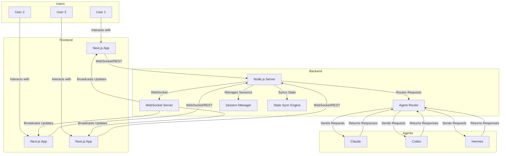

---

## 🔄 **2. Core Data Flows**

---

### **Flow 1: User Joins a Session**

**Scenario**: A user opens the app and joins an existing session.

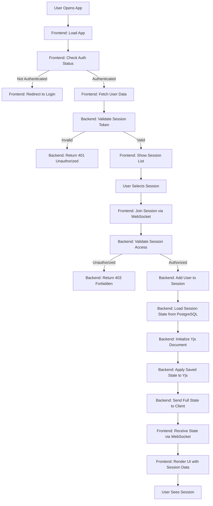

#### **Step-by-Step Breakdown**

| **Step** | **Action** | **Component** | **Data** | **Notes** |
|----------|------------|---------------|----------|-----------|
| 1 | User opens app | Browser | - | Triggers `App.tsx` load. |
| 2 | Frontend checks auth | `useAuth()` hook | JWT token | Uses Clerk/Supabase. |
| 3 | Fetch user data | `GET /api/users/me` | User object | Includes name, email, avatar. |
| 4 | Validate session token | `authMiddleware` | JWT token | Checks expiry and validity. |
| 5 | Show session list | `SessionsPage` | Session[] | Fetches from `GET /api/sessions`. |
| 6 | User selects session | UI click | sessionId | Navigates to `/session/{id}`. |
| 7 | Join session via WebSocket | `socket.emit('join-session')` | { sessionId } | Connects to Socket.io. |
| 8 | Validate session access | `sessionMiddleware` | sessionId, userId | Checks permissions in PostgreSQL. |
| 9 | Add user to session | `SessionManager.addUser()` | userId, sessionId | Updates `SessionParticipant` table. |
| 10 | Load session state | `SessionManager.loadState()` | sessionId | Fetches from PostgreSQL. |
| 11 | Initialize Yjs document | `new Y.Doc()` | - | Creates a new Yjs document. |
| 12 | Apply saved state | `Y.applyUpdate()` | Uint8Array | Deserializes stored Yjs updates. |
| 13 | Send full state to client | `socket.emit('sync-state')` | Uint8Array | Sends serialized Yjs state. |
| 14 | Receive state | `socket.on('sync-state')` | Uint8Array | Frontend applies updates. |
| 15 | Render UI | `WorkspaceComponent` | WorkspaceState | Renders messages, users, etc. |

---

### **Flow 2: User Sends a Message to AI**

**Scenario**: A user types a message in the chat and sends it to the AI agent.

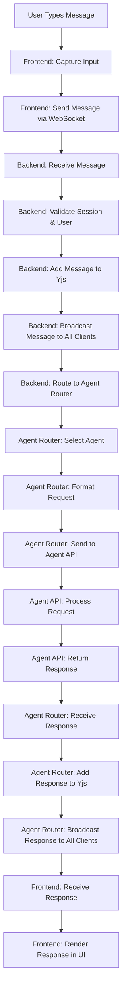

#### **Step-by-Step Breakdown**

| **Step** | **Action** | **Component** | **Data** | **Notes** |
|----------|------------|---------------|----------|-----------|
| 1 | User types message | `ChatInput` | string | Captures text input. |
| 2 | Send message via WebSocket | `socket.emit('send-message')` | { sessionId, content } | Includes user ID. |
| 3 | Receive message | `socket.on('send-message')` | MessageInput | Backend validates. |
| 4 | Validate session & user | `SessionManager.validate()` | sessionId, userId | Checks if user is in session. |
| 5 | Add message to Yjs | `yMessages.push()` | Message | Adds to shared array. |
| 6 | Broadcast message | `socket.broadcast.emit('new-message')` | Message | Sends to all clients in session. |
| 7 | Route to Agent Router | `AgentRouter.route()` | Message | Determines which agent to use. |
| 8 | Select agent | `AgentRouter.selectAgent()` | AgentType | Uses session’s active agent. |
| 9 | Format request | `AgentAdapter.formatRequest()` | AgentRequest | Converts message to agent’s input format. |
| 10 | Send to agent API | `axios.post()` | AgentRequest | Sends to Claude/Codex/etc. |
| 11 | Process request | Agent API | - | Agent generates response. |
| 12 | Return response | Agent API | AgentResponse | Includes content, token usage. |
| 13 | Receive response | `AgentRouter.handleResponse()` | AgentResponse | Backend processes response. |
| 14 | Add response to Yjs | `yMessages.push()` | Message | Adds AI response to shared array. |
| 15 | Broadcast response | `socket.broadcast.emit('new-message')` | Message | Sends to all clients. |
| 16 | Receive response | `socket.on('new-message')` | Message | Frontend updates UI. |
| 17 | Render response | `ChatMessage` | - | Displays in chat. |

---

### **Flow 3: Agent Handoff**

**Scenario**: User A hands off control of the AI agent to User B.

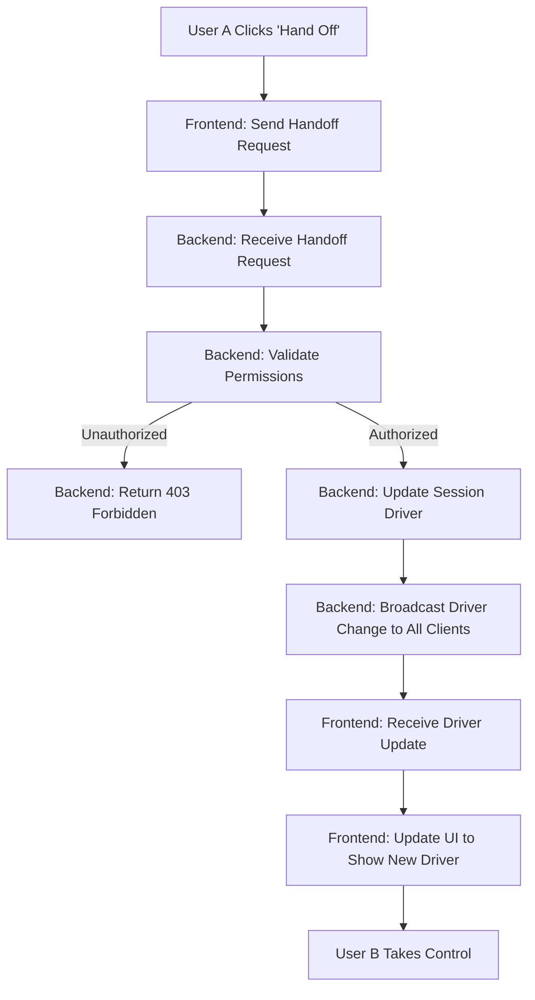

#### **Step-by-Step Breakdown**

| **Step** | **Action** | **Component** | **Data** | **Notes** |
|----------|------------|---------------|----------|-----------|
| 1 | User A clicks "Hand Off" | `HandoffButton` | - | UI action. |
| 2 | Send handoff request | `socket.emit('handoff')` | { sessionId, newDriverId } | Includes target user. |
| 3 | Receive handoff request | `socket.on('handoff')` | HandoffRequest | Backend processes. |
| 4 | Validate permissions | `SessionManager.checkPermissions()` | sessionId, userId, newDriverId | Checks if user can handoff. |
| 5 | Return 403 if unauthorized | `socket.emit('error')` | { error: "Unauthorized" } | Frontend shows error. |
| 6 | Update session driver | `SessionManager.updateDriver()` | sessionId, newDriverId | Updates `driverId` in session. |
| 7 | Broadcast driver change | `socket.broadcast.emit('driver-change')` | { sessionId, driverId } | Sends to all clients. |
| 8 | Receive driver update | `socket.on('driver-change')` | { driverId } | Frontend updates state. |
| 9 | Update UI | `WorkspaceHeader` | - | Shows new driver’s avatar. |
| 10 | User B takes control | - | - | Can now send agent requests. |

---

### **Flow 4: Session Persistence**

**Scenario**: A user ends a session, and the state is saved for later.

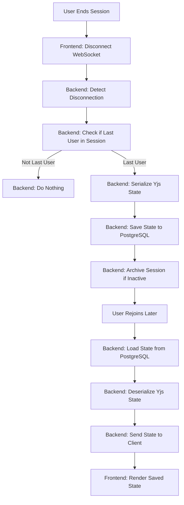

#### **Step-by-Step Breakdown**

| **Step** | **Action** | **Component** | **Data** | **Notes** |
|----------|------------|---------------|----------|-----------|
| 1 | User ends session | Browser | - | Closes tab or navigates away. |
| 2 | Disconnect WebSocket | `socket.disconnect()` | - | Frontend cleans up. |
| 3 | Detect disconnection | `socket.on('disconnect')` | - | Backend detects. |
| 4 | Check if last user | `SessionManager.isLastUser()` | sessionId | Checks active connections. |
| 5 | Do nothing | - | - | Session remains active. |
| 6 | Serialize Yjs state | `Y.encodeStateAsUpdate()` | Uint8Array | Converts Yjs state to binary. |
| 7 | Save state to PostgreSQL | `SessionHistory.create()` | { sessionId, snapshot } | Stores in database. |
| 8 | Archive session if inactive | `SessionManager.archiveIfInactive()` | sessionId | After 30 days of inactivity. |
| 9 | User rejoins later | - | - | Opens app again. |
| 10 | Load state from PostgreSQL | `SessionHistory.findLatest()` | sessionId | Fetches most recent snapshot. |
| 11 | Deserialize Yjs state | `Y.applyUpdate()` | Uint8Array | Reconstructs Yjs document. |
| 12 | Send state to client | `socket.emit('sync-state')` | Uint8Array | Sends full state. |
| 13 | Render saved state | `WorkspaceComponent` | WorkspaceState | UI updates. |

---

### **Flow 5: Agent Fallback**

**Scenario**: The primary agent (Claude) fails, so the system falls back to Codex.

```mermaid
graph TD
    A[User Sends Message] --> B[Backend: Route to Claude]
    B --> C[Claude API: Process Request]
    C -->|Success| D[Backend: Return Response]
    C -->|Failure| E[Backend: Catch Error]
    E --> F[Backend: Check Fallback Chain]
    F --> G[Backend: Try Next Agent (Codex)]
    G --> H[Codex API: Process Request]
    H -->|Success| I[Backend: Return Response]
    H -->|Failure| J[Backend: Try Next Agent (Hermes)]
    J --> K[Hermes API: Process Request]
    K --> L[Backend: Return Response or Error]
```

#### **Step-by-Step Breakdown**

| **Step** | **Action** | **Component** | **Data** | **Notes** |
|----------|------------|---------------|----------|-----------|
| 1 | User sends message | `socket.emit('send-message')` | { content } | Triggered by UI. |
| 2 | Route to Claude | `AgentRouter.route()` | AgentRequest | Uses session’s active agent. |
| 3 | Claude processes request | `ClaudeAdapter.sendMessage()` | - | API call to Anthropic. |
| 4 | Return response | - | AgentResponse | If successful. |
| 5 | Catch error | `try/catch` | Error | If Claude fails (rate limit, downtime). |
| 6 | Check fallback chain | `FALLBACK_CHAIN.claude` | AgentType[] | ["codex", "hermes"]. |
| 7 | Try Codex | `AgentRouter.sendMessageWithFallback()` | AgentRequest | Retries with Codex. |
| 8 | Codex processes request | `CodexAdapter.sendMessage()` | - | API call to OpenAI. |
| 9 | Return response | - | AgentResponse | If successful. |
| 10 | Try Hermes | - | AgentRequest | If Codex fails. |
| 11 | Hermes processes request | `HermesAdapter.sendMessage()` | - | API call to Hugging Face. |
| 12 | Return response or error | - | AgentResponse | Final response or error. |

---

## 🔗 **3. Integration Data Flows**

---

### **Flow 6: GitHub Integration**

**Scenario**: User connects their GitHub repo, and the AI helps edit code directly.

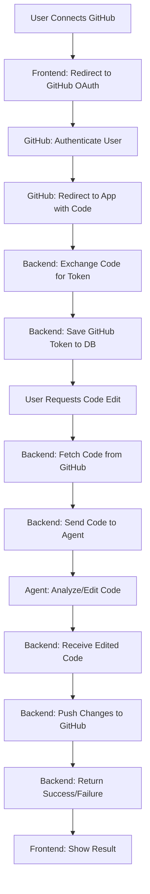

#### **Step-by-Step Breakdown**

| **Step** | **Action** | **Component** | **Data** | **Notes** |
|----------|------------|---------------|----------|-----------|
| 1 | User connects GitHub | `GitHubButton` | - | Clicks "Connect GitHub". |
| 2 | Redirect to GitHub OAuth | `window.location` | OAuth URL | Uses GitHub’s OAuth flow. |
| 3 | GitHub authenticates user | GitHub OAuth | - | User logs in to GitHub. |
| 4 | Redirect to app with code | GitHub OAuth | { code } | GitHub redirects back to app. |
| 5 | Exchange code for token | `POST /api/integrations/github` | { code } | Backend exchanges code for access token. |
| 6 | Save GitHub token | `UserIntegration.create()` | { userId, token } | Stores in PostgreSQL. |
| 7 | User requests code edit | `socket.emit('edit-code')` | { repo, file, prompt } | e.g., "Fix this bug". |
| 8 | Fetch code from GitHub | `GitHubAPI.getFile()` | { repo, file } | Uses GitHub API. |
| 9 | Send code to agent | `AgentRouter.route()` | AgentRequest | Includes code + prompt. |
| 10 | Agent analyzes/edits code | Agent API | - | e.g., Claude Code. |
| 11 | Receive edited code | `AgentRouter.handleResponse()` | { editedCode } | Agent’s response. |
| 12 | Push changes to GitHub | `GitHubAPI.pushFile()` | { repo, file, editedCode } | Commits changes. |
| 13 | Return success/failure | `socket.emit('edit-result')` | { success, message } | Frontend shows result. |
| 14 | Show result | `CodeEditor` | - | Displays edited code. |

---

### **Flow 7: Slack Integration**

**Scenario**: User starts an AI session from Slack and shares the output.

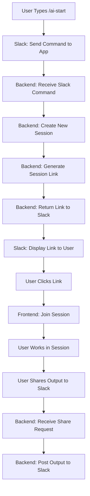

#### **Step-by-Step Breakdown**

| **Step** | **Action** | **Component** | **Data** | **Notes** |
|----------|------------|---------------|----------|-----------|
| 1 | User types `/ai-start` | Slack | - | Slash command. |
| 2 | Slack sends command | Slack API | { command, userId } | Webhook to backend. |
| 3 | Receive Slack command | `POST /api/slack/command` | SlackRequest | Backend processes. |
| 4 | Create new session | `SessionManager.create()` | { userId } | Creates session in DB. |
| 5 | Generate session link | `SessionManager.generateLink()` | { sessionId } | e.g., `https://app.com/session/abc123`. |
| 6 | Return link to Slack | `SlackAPI.respond()` | { text: link } | Slack displays link. |
| 7 | Slack displays link | Slack UI | - | User sees clickable link. |
| 8 | User clicks link | Browser | - | Navigates to app. |
| 9 | Join session | `socket.emit('join-session')` | { sessionId } | Frontend joins. |
| 10 | User works in session | - | - | Collaborates with AI/team. |
| 11 | User shares output | `socket.emit('share-to-slack')` | { sessionId, message } | e.g., "Post this to Slack". |
| 12 | Receive share request | `socket.on('share-to-slack')` | ShareRequest | Backend processes. |
| 13 | Post output to Slack | `SlackAPI.postMessage()` | { channel, text } | Posts to Slack channel. |

---

## 📊 **4. State Synchronization Flow**

**Scenario**: How **Yjs + WebSockets** keep all clients in sync.

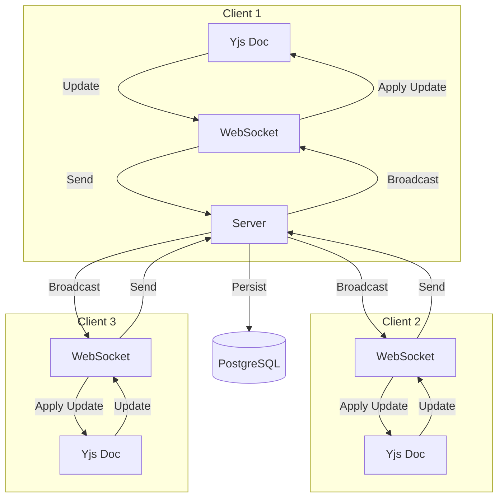

### **How It Works**

1. **Client 1** makes an edit (e.g., types a message).
2. **Yjs on Client 1** generates an **update** (binary data representing the change).
3. **Client 1** sends the update to the **server via WebSocket**.
4. **Server** receives the update and:
   - **Applies it to its own Yjs document** (for state consistency).
   - **Broadcasts the update to all other clients** in the session.
   - **Persists the update to PostgreSQL** (for session history).
5. **Client 2 and Client 3** receive the update via WebSocket and:
   - **Apply it to their local Yjs documents**.
   - **Update their UIs** to reflect the change.

### **Key Properties**
| **Property** | **Implementation** | **Benefit** |
|--------------|--------------------|-------------|
| **Conflict-Free** | Yjs CRDTs | No merge conflicts. |
| **Real-Time** | WebSockets | Instant updates. |
| **Persistent** | PostgreSQL | Session history. |
| **Scalable** | Redis pub/sub | Handles 1,000+ users. |

---

## 🔍 **5. Error Handling Flows**

---

### **Flow 8: Agent API Rate Limit**

**Scenario**: An agent API (e.g., Claude) returns a **rate limit error**.

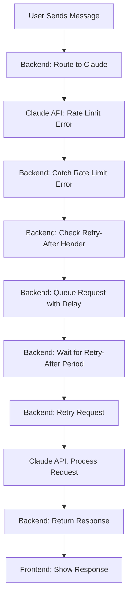

#### **Step-by-Step Breakdown**

| **Step** | **Action** | **Component** | **Data** | **Notes** |
|----------|------------|---------------|----------|-----------|
| 1 | User sends message | - | - | Normal flow. |
| 2 | Route to Claude | `AgentRouter.route()` | - | Uses Claude adapter. |
| 3 | Rate limit error | `ClaudeAdapter.sendMessage()` | 429 Error | Includes `Retry-After` header. |
| 4 | Catch rate limit error | `try/catch` | Error | Backend handles. |
| 5 | Check Retry-After | `error.response.headers['retry-after']` | number | e.g., 60 seconds. |
| 6 | Queue request with delay | `BullMQ.add()` | { prompt, delay } | Adds to queue with delay. |
| 7 | Wait for Retry-After | `BullMQ.wait()` | - | Pauses execution. |
| 8 | Retry request | `ClaudeAdapter.sendMessage()` | - | Retries after delay. |
| 9 | Process request | - | - | If rate limit is lifted. |
| 10 | Return response | - | AgentResponse | Success or new error. |
| 11 | Show response | - | - | Frontend updates UI. |

---

### **Flow 9: WebSocket Disconnection**

**Scenario**: A user’s WebSocket disconnects (e.g., due to network issues).

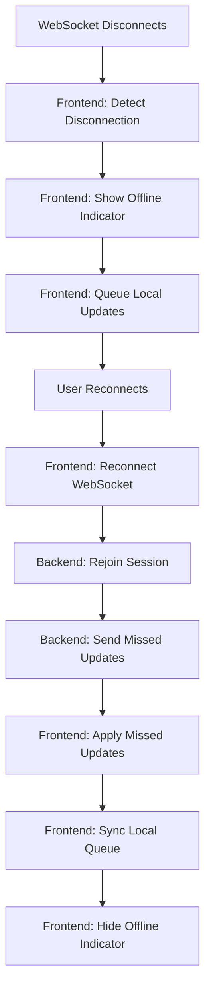

#### **Step-by-Step Breakdown**

| **Step** | **Action** | **Component** | **Data** | **Notes** |
|----------|------------|---------------|----------|-----------|
| 1 | WebSocket disconnects | Socket.io | - | Network issue or tab close. |
| 2 | Detect disconnection | `socket.on('disconnect')` | - | Frontend listens for disconnect. |
| 3 | Show offline indicator | `OfflineBanner` | - | UI shows "Offline" banner. |
| 4 | Queue local updates | `Yjs` | Update[] | Stores updates locally. |
| 5 | User reconnects | - | - | Network restores or tab reopens. |
| 6 | Reconnect WebSocket | `socket.connect()` | - | Re-establishes connection. |
| 7 | Rejoin session | `socket.emit('join-session')` | { sessionId } | Backend re-adds user. |
| 8 | Send missed updates | `socket.emit('sync-state')` | Uint8Array | Server sends updates missed during downtime. |
| 9 | Apply missed updates | `Y.applyUpdate()` | Uint8Array | Frontend catches up. |
| 10 | Sync local queue | `Yjs` | Update[] | Applies queued local updates. |
| 11 | Hide offline indicator | `OfflineBanner` | - | UI returns to normal. |

---

## 📈 **6. Performance Optimization Flows**

---

### **Flow 10: Caching Agent Responses**

**Scenario**: The same prompt is sent multiple times (e.g., "Explain this concept").

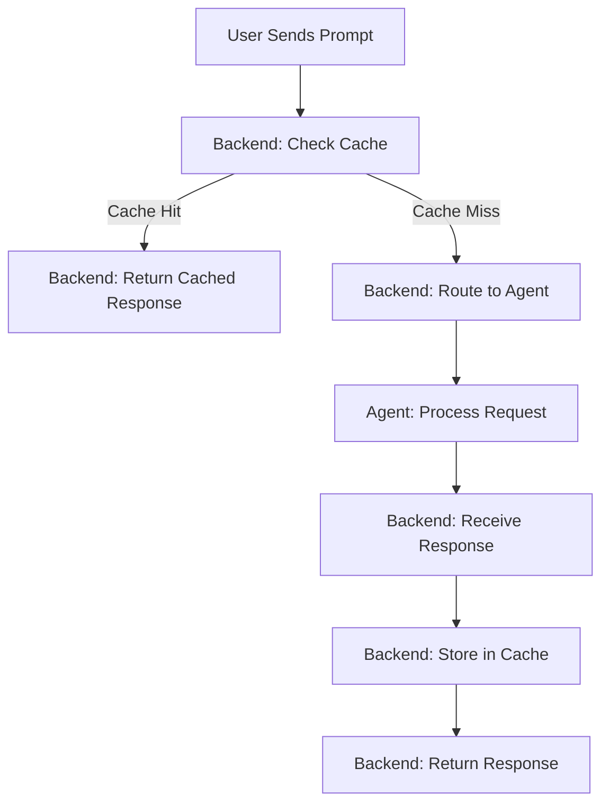

#### **Step-by-Step Breakdown**

| **Step** | **Action** | **Component** | **Data** | **Notes** |
|----------|------------|---------------|----------|-----------|
| 1 | User sends prompt | - | { prompt } | Normal flow. |
| 2 | Check cache | `Redis.get()` | { prompt } | Uses prompt as cache key. |
| 3 | Return cached response | `socket.emit('new-message')` | Message | If cache hit. |
| 4 | Route to agent | `AgentRouter.route()` | - | If cache miss. |
| 5 | Agent processes request | Agent API | - | e.g., Claude. |
| 6 | Receive response | `AgentRouter.handleResponse()` | AgentResponse | From agent. |
| 7 | Store in cache | `Redis.set()` | { prompt, response } | TTL: 1 hour. |
| 8 | Return response | `socket.emit('new-message')` | Message | Frontend updates. |

#### **Cache Key Strategy**
```typescript
// Generate a cache key from the prompt and agent type
function generateCacheKey(prompt: string, agentType: AgentType): string {
  // Normalize the prompt (trim, lowercase, remove special chars)
  const normalizedPrompt = prompt
    .trim()
    .toLowerCase()
    .replace(/[^a-z0-9\s]/g, '');
  
  // Use a hash function to keep keys short
  const hash = crypto
    .createHash('sha256')
    .update(`${agentType}:${normalizedPrompt}`)
    .digest('hex');
  
  return `agent_response:${hash}`;
}
```

---

### **Flow 11: Batching Agent Requests**

**Scenario**: Multiple users send requests to the same agent in quick succession.

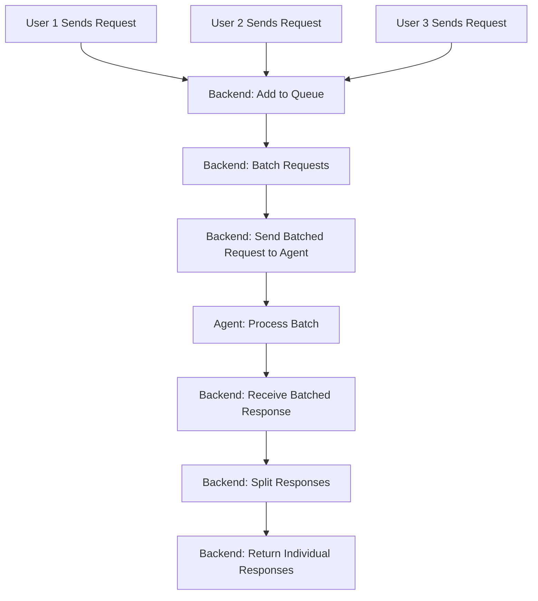

#### **Step-by-Step Breakdown**

| **Step** | **Action** | **Component** | **Data** | **Notes** |
|----------|------------|---------------|----------|-----------|
| 1 | Users send requests | - | Request[] | Multiple requests in quick succession. |
| 2 | Add to queue | `BullMQ.add()` | Request | Each request is queued. |
| 3 | Batch requests | `BullMQ.process()` | Request[] | Groups requests to the same agent. |
| 4 | Send batched request | `AgentAdapter.sendBatch()` | BatchRequest | Single API call with multiple prompts. |
| 5 | Agent processes batch | Agent API | - | e.g., Claude’s batch endpoint. |
| 6 | Receive batched response | `AgentRouter.handleBatchResponse()` | BatchResponse | From agent. |
| 7 | Split responses | `BatchResponse.split()` | Response[] | Separates responses for each user. |
| 8 | Return individual responses | `socket.emit('new-message')` | Message[] | Frontend updates for each user. |

---

## 🎯 **Summary of Key Flows**

| **Flow** | **Purpose** | **Key Components** | **Complexity** |
|----------|-------------|---------------------|----------------|
| User Joins Session | Load and sync session state | Session Manager, Yjs, WebSockets | Medium |
| User Sends Message | Route to agent and broadcast response | Agent Router, Yjs, WebSockets | Medium |
| Agent Handoff | Transfer control to another user | Session Manager, WebSockets | Low |
| Session Persistence | Save and restore session state | PostgreSQL, Yjs | Medium |
| Agent Fallback | Handle agent failures | Agent Router, Fallback Chain | Medium |
| GitHub Integration | Edit code directly | GitHub API, Agent Router | High |
| Slack Integration | Start sessions from Slack | Slack API, Session Manager | Medium |
| State Synchronization | Keep clients in sync | Yjs, WebSockets | High |
| Rate Limit Handling | Retry after rate limits | BullMQ, Agent Router | Medium |
| WebSocket Disconnection | Handle offline users | Socket.io, Yjs | Medium |
| Caching | Reduce agent API calls | Redis, Agent Router | Low |
| Batching | Reduce agent API costs | BullMQ, Agent Router | Medium |

---

## 📁 **Diagram Directory**

All diagrams in this document are created using **Mermaid.js**. For additional visualizations, see:
- [Architecture Overview](../architecture/OVERVIEW.md) – High-level system design.
- [Components](../architecture/COMPONENTS.md) – Detailed component breakdowns.

---

## 🚀 **Next Steps**

1. **Understand the flows**: Review the diagrams and step-by-step breakdowns.
2. **Implement a flow**: Start with the [User Joins Session](#flow-1-user-joins-a-session) flow.
3. **Test edge cases**: Use the error handling flows to ensure robustness.
4. **Optimize**: Apply the performance flows (caching, batching) to improve scalability.

---

## 📞 **Questions or Feedback?**

If you have questions about the data flows or want to contribute:
- Open an **issue** in the [GitHub repository](https://github.com/Ashuyadav96/om).
- Reach out to the **project lead** ([Ashuyadav96](https://github.com/Ashuyadav96)).

---

**Let’s visualize the future of multiplayer AI!** 🚀
