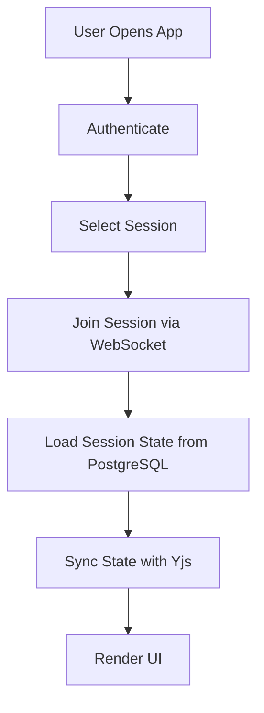
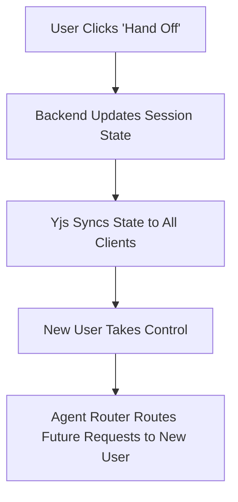
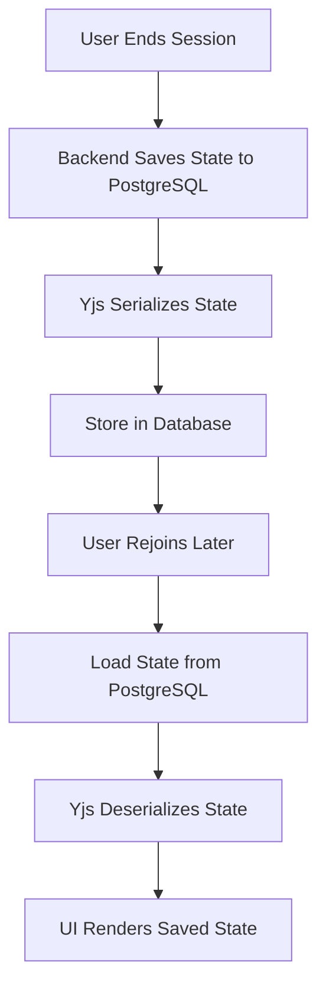

# 🏗 Architecture Overview: Multiplayer AI Orchestration

> **The Technical Backbone of Real-Time AI Collaboration**

---

## 🎯 **High-Level Architecture**

The **Multiplayer AI Orchestration** system is designed as a **modular, scalable platform** that enables **real-time collaboration** between teams and **pre-existing AI agents** (Claude, Codex, Hermes, etc.). The architecture is divided into **three layers**:

1. **User Interface (UI Layer)** – The frontend where users interact with AI agents and teammates.
2. **Orchestration Layer (Core Layer)** – The backend that manages sessions, routes tasks to agents, and syncs state in real time.
3. **External AI Agents (Agent Layer)** – Third-party AI services (Claude, Codex, etc.) that perform the actual work.

```
┌─────────────────────────────────────────────────────────────────┐
│                        USER INTERFACE (UI LAYER)                    │
│  ┌─────────────┐    ┌─────────────┐    ┌───────────────────────┐  │
│  │  Shared     │    │  Agent       │    │  Session              │  │
│  │  Workspace  │    │  Controls    │    │  Management           │  │
│  │  (Next.js)  │    │  (React)     │    │  (React)              │  │
│  └─────────────┘    └─────────────┘    └───────────────────────┘  │
└─────────────────────────────────────────────────────────────────┘
                               │
                               ▼
┌─────────────────────────────────────────────────────────────────┐
│                     ORCHESTRATION LAYER (CORE LAYER)                │
│  ┌─────────────────────────────────────────────────────────────┐  │
│  │  1. Session Manager:                                        │  │
│  │     - Manages shared sessions (create, join, leave)          │  │
│  │     - Tracks users, permissions, and state                    │  │
│  │  2. Agent Router:                                           │  │
│  │     - Routes tasks to 3rd-party agents (Claude, Codex, etc.) │  │
│  │     - Handles authentication, rate limits, and fallbacks      │  │
│  │  3. State Sync Engine:                                     │  │
│  │     - Uses CRDTs (Yjs) for conflict-free real-time editing    │  │
│  │     - Syncs agent outputs, user edits, and cursors           │  │
│  │  4. Memory Layer:                                          │  │
│  │     - Stores session history, context, and agent outputs     │  │
│  │     - Enables persistent memory across sessions             │  │
│  │  5. API Gateway:                                           │  │
│  │     - REST/GraphQL endpoints for frontend and integrations    │  │
│  └─────────────────────────────────────────────────────────────┘  │
└─────────────────────────────────────────────────────────────────┘
                               │
                               ▼
┌─────────────────────────────────────────────────────────────────┐
│                     EXTERNAL AI AGENTS (AGENT LAYER)                │
│  ┌─────────────┐  ┌─────────────┐  ┌─────────────┐  ┌─────────┐  │
│  │  Claude     │  │  Codex       │  │  Hermes      │  │  ...     │  │
│  │  (Anthropic)│  │  (OpenAI)    │  │  (Hugging    │  │         │  │
│  │             │  │             │  │  Face)       │  │         │  │
│  └─────────────┘  └─────────────┘  └─────────────┘  └─────────┘  │
└─────────────────────────────────────────────────────────────────┘
```

---

## 🔧 **Core Components**

### **1. User Interface (UI Layer)**
The frontend is built with **Next.js (React)** and provides a **Figma-like experience** for real-time collaboration.

#### **Subcomponents**
| **Component** | **Purpose** | **Technology** |
|---------------|-------------|----------------|
| **Shared Workspace** | The main canvas where users interact with AI agents and each other. | Next.js, Tailwind CSS |
| **Agent Controls** | UI for selecting, configuring, and switching between AI agents. | React, Headless UI |
| **Session Management** | UI for creating, joining, and managing sessions. | React, React Query |
| **Chat Interface** | Real-time chat with AI agents and teammates. | Next.js, Socket.io Client |
| **Live Cursors** | Visual indicators showing where teammates are typing/editing. | Yjs, React |
| **Version History** | UI for viewing and restoring past session states. | React, Time Travel (Yjs) |

#### **Key Features**
- **Real-Time Collaboration**: Multiple users can type, edit, and interact with AI agents simultaneously.
- **Agent Switching**: Users can switch between different AI agents (Claude, Codex, etc.) mid-session.
- **Session Persistence**: Sessions are saved and can be resumed later.
- **Responsive Design**: Works on **desktop, tablet, and mobile**.

---

### **2. Orchestration Layer (Core Layer)**
The backend is built with **Node.js (Express)** and handles **session management, agent routing, and real-time synchronization**.

#### **Subcomponents**
| **Component** | **Purpose** | **Technology** |
|---------------|-------------|----------------|
| **Session Manager** | Creates, manages, and tracks shared sessions. | Node.js, PostgreSQL |
| **Agent Router** | Routes tasks to the appropriate AI agent and handles responses. | Node.js, Axios |
| **State Sync Engine** | Uses CRDTs (Yjs) to sync state across all clients in real time. | Yjs, WebSockets |
| **Memory Layer** | Stores session history, context, and agent outputs for persistence. | PostgreSQL, Pinecone |
| **API Gateway** | Provides REST/GraphQL endpoints for the frontend and integrations. | Express.js, Apollo Server |
| **Authentication** | Handles user sign-up, login, and API key management. | Clerk, Supabase Auth |

#### **Key Features**
- **Real-Time Sync**: Uses **WebSockets + Yjs** to ensure all users see the same state.
- **Agent Abstraction**: Standardizes interactions with different AI agents (Claude, Codex, etc.).
- **Session Persistence**: Saves session state to **PostgreSQL** for later retrieval.
- **Scalability**: Designed to handle **thousands of concurrent sessions**.

---

### **3. External AI Agents (Agent Layer)**
This layer consists of **third-party AI services** that perform the actual work (e.g., generating text, code, or analysis).

#### **Supported Agents**
| **Agent** | **Provider** | **Use Case** | **API Type** | **Cost** |
|-----------|--------------|--------------|--------------|----------|
| **Claude** | Anthropic | General Q&A, reasoning | REST API | $0.01–0.03/token |
| **Claude Code** | Anthropic | Coding assistant | CLI/API | Free (for now) |
| **Codex** | OpenAI | Code generation | REST API | $0.02/1K tokens |
| **Hermes** | Hugging Face | Reasoning | REST API | Free |
| **OpenClaw** | Open Source | General-purpose | Self-hosted | Free |
| **GitHub Copilot** | GitHub | Coding assistant | VS Code Extension | $10/user/month |
| **Devin** | Cognition AI | Full-stack coding | API (waitlist) | Unknown |

#### **Agent Integration Strategy**
1. **Standardized Interface**: Each agent is wrapped in a **common interface** to handle:
   - Authentication (API keys, OAuth).
   - Input/Output formatting.
   - Error handling (rate limits, timeouts).
2. **Fallback Mechanism**: If an agent fails, the system can **fall back to another agent** or notify the user.
3. **Caching**: Cache **frequent requests** to reduce costs and latency.

---

## 📡 **Data Flow**

### **1. User Joins a Session**


1. User opens the app and **authenticates** (Clerk/Supabase).
2. User **selects or creates a session**.
3. Frontend **connects to the session via WebSocket**.
4. Backend **loads the session state** from PostgreSQL.
5. **Yjs syncs the state** across all connected clients.
6. Frontend **renders the UI** with the latest state.

---

### **2. User Sends a Message to AI**
```mermaid
graph TD
    A[User Types Message] --> B[Send to Backend via WebSocket]
    B --> C[Agent Router Receives Request]
    C --> D[Route to Selected Agent (e.g., Claude)]
    D --> E[Agent Processes Request]
    E --> F[Return Response to Backend]
    F --> G[Broadcast Response to All Clients via WebSocket]
    G --> H[Yjs Updates State]
    H --> I[UI Renders Response]
```

1. User **types a message** in the chat.
2. Frontend **sends the message to the backend via WebSocket**.
3. **Agent Router** receives the request and **routes it to the selected agent** (e.g., Claude).
4. The **agent processes the request** and returns a response.
5. Backend **broadcasts the response to all clients** in the session.
6. **Yjs updates the state** to include the new message.
7. All **frontends render the response** in real time.

---

### **3. User Hands Off to Another User**


1. User **clicks "Hand Off"** in the UI.
2. Backend **updates the session state** to reflect the new "driver."
3. **Yjs syncs the state** to all clients.
4. The **new user takes control** of the agent.
5. **Agent Router** routes future requests to the new user.

---

### **4. Session Persistence**


1. User **ends the session** (or it times out).
2. Backend **saves the state** to PostgreSQL.
3. **Yjs serializes the state** for storage.
4. State is **stored in the database**.
5. User **rejoins the session later**.
6. Backend **loads the state** from PostgreSQL.
7. **Yjs deserializes the state** and syncs it to the client.
8. **UI renders the saved state**.

---

## 🔗 **Integrations**

### **1. GitHub Integration**
- **Purpose**: Allow users to **edit code directly** in the chat (for code agents like Claude Code or Codex).
- **Implementation**:
  - Use **GitHub API** to fetch/repush code.
  - Support **pull requests, issues, and code reviews**.
- **Use Cases**:
  - **Live pair programming** with AI + teammates.
  - **Code reviews** with AI-assisted feedback.

### **2. Slack Integration**
- **Purpose**: Allow users to **start sessions from Slack** and share outputs.
- **Implementation**:
  - Build a **Slack app** with slash commands (e.g., `/ai-start`).
  - Support **notifications** for session updates.
- **Use Cases**:
  - **Team collaboration** without leaving Slack.
  - **Quick AI queries** in team channels.

### **3. Notion Integration**
- **Purpose**: Sync **AI session outputs** to Notion pages.
- **Implementation**:
  - Use **Notion API** to create/update pages.
  - Support **rich text, tables, and databases**.
- **Use Cases**:
  - **Documentation** of AI-assisted work.
  - **Knowledge sharing** across the team.

### **4. Zapier Integration**
- **Purpose**: Enable **custom workflows** with 1,000+ apps.
- **Implementation**:
  - Build a **Zapier app** with triggers (e.g., "New AI Session").
  - Support **actions** (e.g., "Send to Slack").
- **Use Cases**:
  - **Automate workflows** (e.g., "Save AI output to Google Drive").
  - **Connect to CRM, email, or project management tools**.

---

## 🛡 **Security & Privacy**

### **1. Authentication**
- **User Auth**: **Clerk** or **Supabase Auth** for sign-up/login.
- **API Keys**: Users **store their own agent API keys** (encrypted at rest).
- **OAuth**: Support **Google, GitHub, etc.** for SSO.

### **2. Data Encryption**
- **In Transit**: **TLS 1.3** for all communications.
- **At Rest**: **AES-256** encryption for sensitive data (API keys, session history).
- **End-to-End**: Optional **E2E encryption** for enterprise users.

### **3. Rate Limiting & Abuse Prevention**
- **Agent API Limits**: Enforce **per-user rate limits** to prevent abuse.
- **Session Limits**: Limit **concurrent sessions** per user.
- **Spam Detection**: Use **AI to detect and block spam**.

### **4. Compliance**
- **GDPR**: Support **data deletion requests** and **user consent**.
- **SOC 2**: **Audit logs** and **access controls** for enterprise.
- **HIPAA**: **Encryption** and **access restrictions** for healthcare data.

---

## 🚀 **Scalability Considerations**

### **1. Horizontal Scaling**
- **Frontend**: Deploy **multiple instances** behind a load balancer (Vercel).
- **Backend**: Use **Kubernetes** or **serverless** (AWS Lambda) for dynamic scaling.
- **Database**: **PostgreSQL read replicas** for read-heavy workloads.

### **2. Real-Time Performance**
- **WebSocket Servers**: Use **Socket.io with Redis** for horizontal scaling.
- **CRDTs**: **Yjs** is optimized for **low-latency sync** even with 1,000+ users.
- **Caching**: Cache **frequent agent responses** to reduce latency.

### **3. Cost Optimization**
- **Agent API Costs**: Use **smaller models** (e.g., Mistral-7B) for non-critical tasks.
- **Caching**: Cache **common requests** (e.g., "Explain this concept").
- **Batching**: Batch **multiple requests** to the same agent.

---

## 📊 **Monitoring & Observability**

### **1. Logging**
- **Structured Logs**: Use **Winston** or **Pino** for backend logging.
- **Frontend Logs**: Use **Sentry** for error tracking.

### **2. Metrics**
- **Prometheus**: Track **latency, error rates, and usage metrics**.
- **Grafana**: Visualize **performance dashboards**.

### **3. Alerting**
- **PagerDuty**: Alert on **critical failures** (e.g., agent API downtime).
- **Slack Notifications**: Notify the team of **non-critical issues**.

---

## 🔧 **Deployment Architecture**

### **Development Environment**
- **Local**: Run **frontend + backend locally** with `npm run dev`.
- **Docker**: Use **Docker Compose** for local PostgreSQL + Redis.

### **Staging Environment**
- **Frontend**: Deploy to **Vercel Preview** for testing.
- **Backend**: Deploy to **Railway Staging** or **Heroku**.
- **Database**: Use **Supabase** or **Railway PostgreSQL**.

### **Production Environment**
- **Frontend**: Deploy to **Vercel** (auto-scaling, edge network).
- **Backend**: Deploy to **AWS ECS** or **Google Cloud Run**.
- **Database**: **AWS RDS** or **Google Cloud SQL** (PostgreSQL).
- **Real-Time**: **Socket.io with Redis** (for horizontal scaling).
- **Monitoring**: **Prometheus + Grafana + PagerDuty**.

---

## 📁 **Repository Structure**

```
multiplayer-ai-orchestration/
├── docs/
│   ├── architecture/
│   │   ├── OVERVIEW.md         # This file
│   │   ├── COMPONENTS.md       # Detailed component breakdown
│   │   └── DATA_FLOW.md        # Data flow diagrams
│   ├── development/
│   │   ├── SETUP.md           # Local setup guide
│   │   ├── BUILD.md            # Build instructions
│   │   └── DEPLOY.md           # Deployment guide
│   ├── api/
│   │   ├── REFERENCE.md        # API documentation
│   │   └── AUTH.md             # Authentication guide
│   ├── agents/
│   │   ├── INTEGRATIONS.md    # Agent integration guide
│   │   ├── CLAUDE.md           # Claude-specific docs
│   │   └── CODEX.md            # Codex-specific docs
│   ├── PRODUCT.md              # Product vision
│   ├── ROADMAP.md              # Development roadmap
│   └── CONTRIBUTING.md         # Contribution guidelines
├── src/
│   ├── client/                 # Frontend (Next.js)
│   │   ├── components/         # React components
│   │   ├── pages/              # Next.js pages
│   │   ├── styles/             # Tailwind CSS
│   │   └── utils/              # Frontend utilities
│   ├── server/                 # Backend (Node.js)
│   │   ├── controllers/        # Route controllers
│   │   ├── services/           # Business logic
│   │   ├── models/             # Database models
│   │   ├── routes/             # Express routes
│   │   └── utils/              # Backend utilities
│   └── shared/                 # Shared types and utilities
│       ├── types/              # TypeScript types
│       └── constants/          # Shared constants
├── .github/
│   └── workflows/              # GitHub Actions
├── .env.example                # Environment variables template
├── package.json
├── docker-compose.yml         # Local development with Docker
└── README.md
```

---

## 🎯 **Next Steps**

1. **Dive into Components**: Read [COMPONENTS.md](COMPONENTS.md) for a detailed breakdown of each module.
2. **Set Up Locally**: Follow [SETUP.md](../development/SETUP.md) to run the project locally.
3. **Explore Data Flow**: See [DATA_FLOW.md](DATA_FLOW.md) for visual diagrams of how data moves through the system.

---

## 📞 **Questions or Feedback?**

If you have questions about the architecture or want to contribute:
- Open an **issue** in the [GitHub repository](https://github.com/Ashuyadav96/om).
- Reach out to the **project lead** ([Ashuyadav96](https://github.com/Ashuyadav96)).

---

**Let’s build the technical backbone of multiplayer AI!** 🚀
